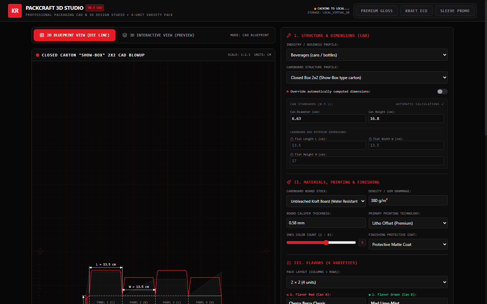

# PackCraft Studio: packaging spec, die-line and approval in one screen

**Live app:** https://juliiyabrodska-tech.github.io/packaging-studio-app-/

Packaging projects usually stall between marketing, the print house and production: specs live in email threads, die-lines are redrawn by hand, and nobody is sure which version was approved. This app keeps the whole spec in one place and produces the documents each side needs.

## Screenshot



## What it does

- **Configure the pack:** 5 structures (2×2 carton, basket with handle, sleeve, tube carton, pillow pouch), board and material, print method, ink count, coating, and options such as dividers, finger holes or tear strip.
- **Set the assortment:** grid from 1×2 to 3×3 units; carton length, width and height recalculate from the grid and unit size.
- **See it instantly:** parametric 2D die-line with cut and fold lines, plus a 3D preview of the pack with your uploaded artwork.
- **Get the numbers:** board area, weight and cost estimate per unit and per batch; full bill of materials as CSV.
- **Sign off:** team approval checkboxes that gate the export, and a printable PDF approval form with specs, BOM, die-line and signature fields.
- **Reuse across industries:** beverage, cosmetics, food, e-commerce, pharma or generic. The labels adapt ("Can / Flavor", "Jar / Shade", "Item / Dosage") without code changes, and the app can be white-labelled with your brand name and colours.

Cost figures are estimates from a simple area × grammage × price formula, meant for early quoting, not a supplier price.

## Stack

React, TypeScript, Vite, Tailwind CSS, jsPDF. Runs fully in the browser; specs are saved locally.

## Run locally

Prerequisite: Node.js

```bash
npm install
npm run dev     # http://localhost:3000
```

Built by Yuliia Brodska with AI-assisted development (Google AI Studio, Claude).
